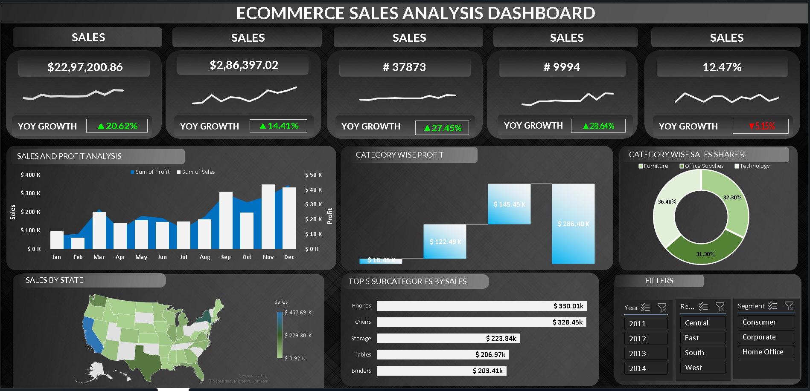

# 🛍️ E-Commerce Sales Analysis Dashboard

## 📌 Project Overview

The **E-Commerce Sales Analysis Dashboard** is an end-to-end business intelligence solution designed to monitor, analyze, and optimize sales and profit performance across different regions, categories, and customer segments.

This dashboard provides a comprehensive view of key KPIs, helping businesses uncover trends, track growth, and make data-driven strategic decisions.

---

## 🎯 Objectives

* Track overall sales, profit, and order performance
* Analyze year-over-year (YoY) growth trends
* Identify high-performing categories and subcategories
* Understand regional sales distribution
* Evaluate customer segments and market performance

---

## 📊 Key Metrics

* 💰 **Total Sales:** $2.29M+
* 💵 **Total Profit:** $286K+
* 📦 **Total Orders:** 37,873
* 🧾 **Total Customers / Records:** 9,994
* 📈 **Profit Margin:** 12.47%

---

## 📈 Dashboard Highlights

### 🚀 Growth Analysis

* Strong **YoY growth in sales (+20.62%)**
* Profit and order volume also show consistent upward trends
* Slight decline in one KPI highlights areas for improvement

### 📅 Sales & Profit Trends

* Monthly analysis reveals peak performance in **Q4 (Oct–Dec)**
* Sales and profit show a positive correlation over time

### 🧩 Category Insights

* Balanced contribution across:

  * Furniture
  * Office Supplies
  * Technology
* Category-wise profit highlights **Technology as a key profit driver**

### 🗺️ Regional Performance

* Sales distribution visualized across U.S. states
* Certain states contribute significantly higher revenue, indicating strong market presence

### 🏆 Top Performing Subcategories

* Phones
* Chairs
* Storage
* Tables
* Binders

These subcategories drive a large portion of total revenue.

---

## 🧰 Tools & Technologies

* **Power BI** – Dashboard design & interactive visualization
* **Excel / CSV Dataset** – Data source
* **Data Modeling** – Relationships, DAX measures, KPIs
* **Data Cleaning** – Preprocessing and transformation

---

## 📷 Dashboard Preview

---

## 💡 Key Insights

* Business shows strong overall growth with increasing sales and profits
* Q4 is the most critical revenue-generating period
* Technology category yields higher profitability compared to others
* A small number of subcategories contribute significantly to total sales (Pareto principle)
* Regional analysis helps identify high and low performing markets

---

## 🚀 How to Use

1. Open the Power BI (.pbix) file
2. Use filters such as:

   * Year
   * Region
   * Segment (Consumer, Corporate, Home Office)
3. Explore:

   * Monthly trends
   * Category performance
   * State-wise sales distribution

---

## 📌 Future Enhancements

* Customer lifetime value (CLV) analysis
* Predictive sales forecasting
* Profit optimization strategies
* Real-time dashboard integration

---

## 👤 Author

**Your Name**

* GitHub: https://github.com/your-username

---

## ⭐ Project Value

This project showcases:

* Strong data visualization skills
* Business intelligence & analytics thinking
* Ability to derive actionable insights from complex datasets
* Hands-on experience with real-world sales data

---

⭐ If you like this project, consider giving it a star!

